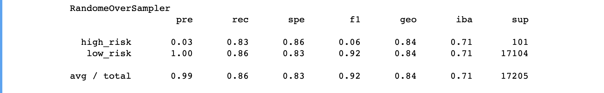
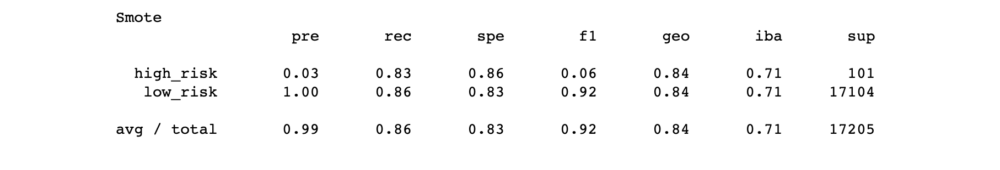
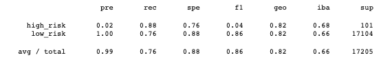
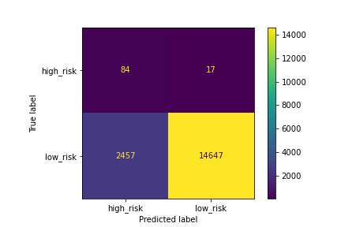
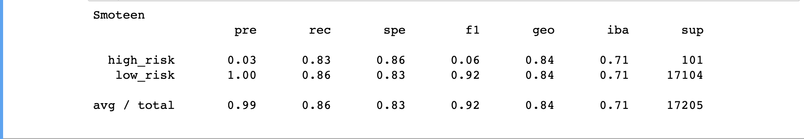
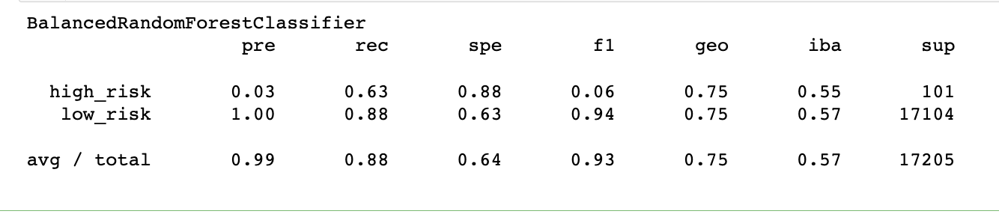
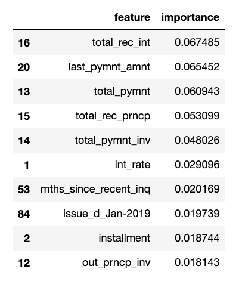
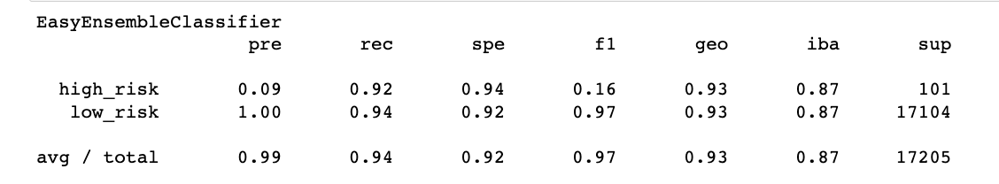

# Credit_Risk_Analysis

## Overview
    Credit risk is an inherently unbalanced classification problem, as good loans easily outnumber risky loans. Therefore, you’ll need to employ different techniques to train and evaluate models with unbalanced classes. We will use imbalanced-learn and scikit-learn libraries to build and evaluate models using resampling.

    Using the credit card credit dataset from LendingClub, a peer-to-peer lending services company, we'll oversample the data using the RandomOverSampler and SMOTE algorithms, and undersample the data using the ClusterCentroids algorithm. Then, we’ll use a combinatorial approach of over- and undersampling using the SMOTEENN algorithm. Next, we will compare two new machine learning models that reduce bias, BalancedRandomForestClassifier and EasyEnsembleClassifier, to predict credit risk.  An  evaluation of the performance of these models and  a written recommendation on whether they should be used to predict credit risk  will be done.

## Results

1. For all three algorithms, the following have been completed:
    An accuracy score for the model is calculated.
    A confusion matrix has been generated. 
    An imbalanced classification report has been generated .

    * The use of resampling to predict credit risk:
       * Compared two oversampling algorithms to determine which algorithm results in the best performance. We oversampled the data using the naive random oversampling algorithm and the SMOTE algorithm.

        * RandomOverSampler had an accuracy score of 0.8325.
          The Confusion Matrix was generated.

          An imbalanced classification report was generated.

        * Smote had an accuracy score 0.844.
          The Confusion Matrix was generated.

          An imbalanced classification report was generated.

        * Next we tested undersampling algorithms to determine which algorithm results in the best performance compared to the oversampling algorithms above using the Cluster Centroids algorithm .

        * ClusterCentroids had an accuracy score of 0.8203.
          A Confusion Matrix was generated.

        An imbalanced report was generated.

2.  Next, test a combination over- and under-sampling algorithm to determine if the algorithm results in the best performance compared to the other sampling algorithms above.  The combinatorial SMOTEENN algorithm had the following:
 
    * An accuracy score for smoteenn was 0.844.
   
      A confusion matrix has been generated.
     

     An imbalanced classification report has been generated
    

3. Lastly, compare two ensemble algorithms, Balanced Random Forest Classifier and an Easy Ensemble AdaBoost classifier  to determine which algorithm results in the best performance. 

    * Balanced Random Forest Classifier had an accoracy score of 0.759.
     
      A Confusion Matrix was generated.

      An imbalanced class report was generated.

      Features were then sorted in descending order by importance.

    * Easy Ensemble AdaBoost classifier had an accoracy score of 0.932.

      A Confusion Matrix was generated.

      An imbalanced report was generated.
    

# Summary

     The resampling of data using  oversampling with Random over sampler and smote had low precision and f1 scores. The f1 score was less than .08. The use of undersampling with Cluster centroids also had a low f1 score, showing that all three of these models were not an accurate way to predict credit risk.

     Also using the combinatorial algorithm smoteenn proved not to be an accurate model.

     Lastly, using ensemble classifiers turned out better models. The BalancedRandomForestClassifier  provided features based on importance and EasyEnsembleClassifier produced the best f1 score with 0.16. Even though this was not a high score it still proved to be the best model used. Overall I do not believe any of these models to be strong to calculate credit risk, but if needed EasyEnsembleClassifier seems to be the best model to use.
